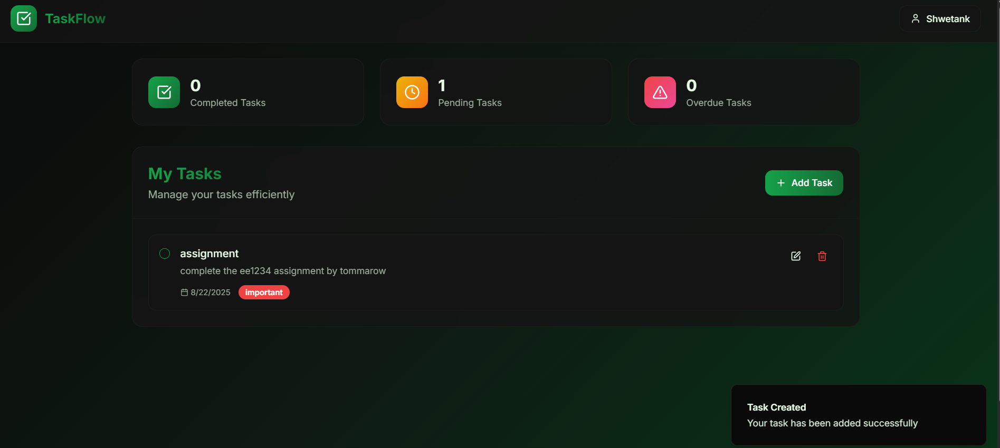

# TaskFlow

### _A Task Manager powered with AI_

---

## 📌 Overview

**TaskFlow** is a modern, intelligent task management application built using a React single-page application architecture. It empowers users to efficiently manage their daily tasks by leveraging the capabilities of AI. Whether you're a student, professional, or simply someone trying to stay organized, TaskFlow helps you structure your priorities through an intuitive UI and smart scheduling assistant.

---

## ❓ Problem Statement

In our daily lives, we are often overwhelmed by a large number of tasks, which leads to missing out on important priorities. Manual tracking can be inefficient and stressful. **TaskFlow** addresses this challenge by combining a user-friendly interface with an AI assistant that helps prioritize and guide the user’s focus effectively.

---

## 🛠 Tools and Technologies

- **Frontend**: React.js, TailwindCSS
- **Backend**: Node.js, Express.js
- **Database**: MongoDB
- **AI Integration**: Mistral AI (LLM)
- **Others**: REST APIs, JWT Authentication

---

## 🧪 Methods

- Semantic task parsing to understand task intent and deadline.
- Prioritization logic based on due date, urgency, and importance.
- Conversational AI assistant (powered by Mistral) to guide task decisions and provide actionable insights.
- State management through React Context API.

---

## 📊 Dashboard / Model / Output



## 🚀 How to Run this Project?

### 1. Clone the Repository

```bash
git clone https://github.com/your-username/taskflow.git
cd taskflow
```

### 2. Setup Backend

```bash
cd backend
npm install
```

Create a `.env` file in the `backend` directory by copying the example:

```bash
cp example.env .env
```

Then, edit the `.env` file and replace the placeholders:

```
MONGO_URI=<your-mongodb-uri>
MISTRAL_API_KEY=<your-mistral-api-key>
```

> 💡 **Mistral API keys are free** — sign up at [https://mistral.ai](https://mistral.ai) to get yours.  
> 💡 After signing up, navigate to the **API Keys** section and generate a new API key.

### 3. Setup Frontend

```bash
cd ../frontend
npm install
```

### 4. Run the Application

Start the backend server:

```bash
cd ../backend
npm run dev
```

In a new terminal, start the frontend server:

```bash
cd ../frontend
npm run dev
```

### ✅ Default Ports

- Backend: `http://localhost:3000`
- Frontend: `http://localhost:8000`
